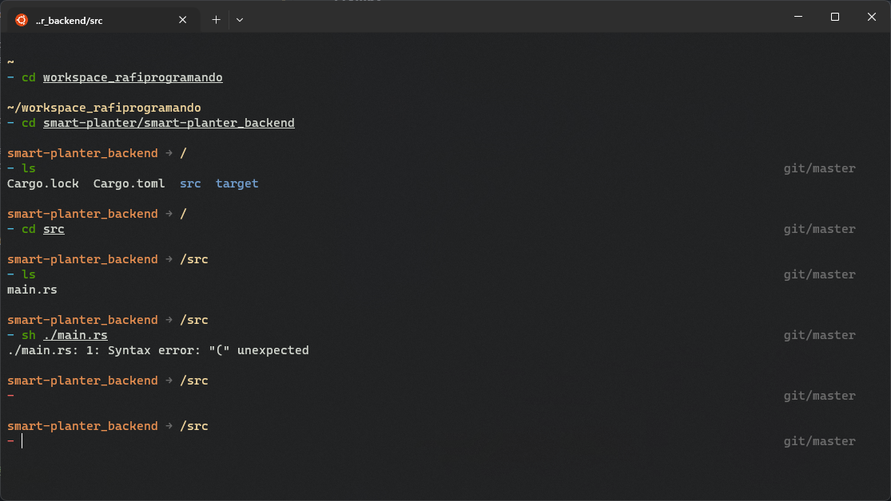

# Monsi - Oh My ZSH theme!

## **Preview**



---

## **Overview**
### Theme include vsc_info settings.

### **Path segments**

- **vsc status line** - This segment displays current branch status in the working directory

---

## **Installation**

_For Installation you need git_

### **Oh My Zsh**

1. Clone the repository:

```shell
git clone https://github.com/rafa-wine/monsi_oh-my-zsh_theme.git
```

2. Move file to oh-my-zsh's theme folder:

```shell
 mv ~/monsi_oh-my-zsh_theme/monsi.zsh-theme ~/.oh-my-zsh/themes/
```

3. Go to your `~/.zshrc` file and set `ZSH_THEME=monsi`

```shell
 nvim ~/.zshrc
```

4. Delete unnecessary data:

```shell
 rm -rf monsi_oh-my-zsh_theme
```

5. Enjoy 😎